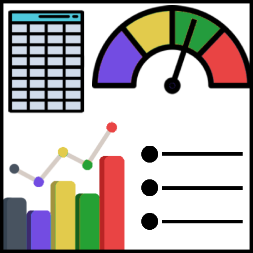

### Generating Synthetic Datasets

  
  

    
I can generate structured and unstructured datasets which mimic real data - these could be numerical values, mulitlingual text, or even multimedia files such as image and audio. These datasets can be used to aid development of proof-of-concept capabilities, training machine learning models or even test the functionality of new software.

  

---

### Data and AI Solutions using Microsoft Azure

  
  

    
I can provide advice and hands-on support in the planning, deployment and configuration of infrastructure to support data and AI workloads. My key expertise is centred on building proof-of-concept demonstrators of data management, data analytics and exploitation, and multimedia AI capabilities using Microsoft Azure.

  

---

### Advice and Coaching

  
  

    
I give advice and provide coaching on data strategy (team structures, data platformns, et.c) and technical implementation (best practices for the set-up and maintenance of data projects). I can help guide teams on data engineering (data quality, modelling, pipelines), data analytics (machine learning, data visualisation, monitoring) and processes such as documentation and AGILE working.

  

---

### Data Analytics

  
  

    
I can get more value from your data by applying machine learning techniques and predictive modelling. Using a combination of numerical analysis, text analytics and image analysis I can help solve business problems and support future decision making.

  

